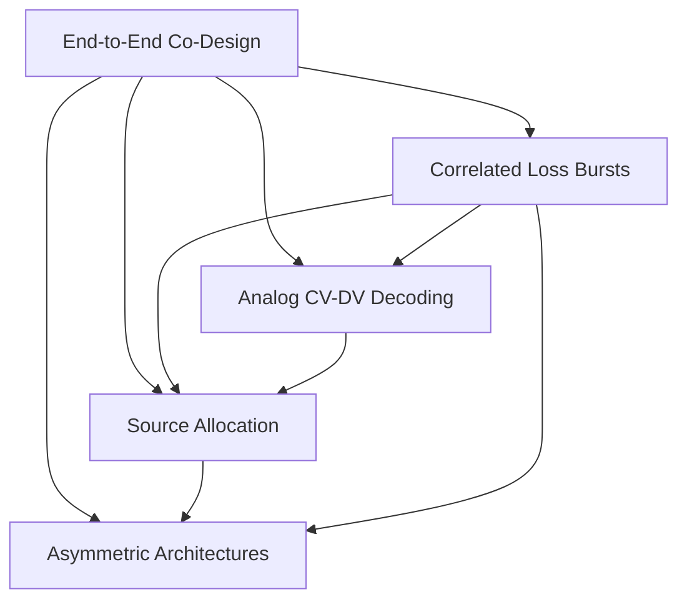

# Quantum Photonics Ideas

This is the central index for five connected paper directions combining photonic simulation, quantum error correction, differentiable optimization, and decoding.

## Ideas

1. [[End-to-End Differentiable Photonic Fault-Tolerance Co-Design]] — jointly optimize the physical photonic system and QEC stack for logical performance.
2. [[Anish's Second Brain/Projects/Quantum/Phase 2 Notes - Decoder-Aware Photonic Hardware Allocation|Phase 2 - Decoder-Aware Photonic Hardware Allocation]] — place higher-quality components where they reduce logical error most.
3. [[Differentiable Discovery of Asymmetric Photonic QEC Architectures]] — discover nonuniform redundancy under a fixed resource budget.
4. [[Analog-Information Decoding Across CV-DV Photonic QEC]] — preserve continuous-variable measurement confidence instead of hard-thresholding it.
5. [[Correlated Photon-Loss Burst QEC]] — design decoders and architectures for correlated loss bursts.

## How the ideas connect

- **Idea 1** is the broad co-design framework.
- **Idea 2** is a constrained allocation problem within that framework.
- **Idea 3** expands the design variables from component quality to topology and redundancy.
- **Idea 4** focuses on the information interface between continuous-variable measurements and a discrete-variable decoder; it is the most study-intensive direction because it combines CV/GKP-style measurement modeling with soft decoding.
- **Idea 5** supplies a realistic correlated-noise model that can stress-test Ideas 1–4.

## Suggested study path

Start with [[Anish's Second Brain/Projects/Quantum/Phase 2 Notes - Decoder-Aware Photonic Hardware Allocation|Phase 2 - Decoder-Aware Photonic Hardware Allocation]] or [[Correlated Photon-Loss Burst QEC]] to build decoder and noise-modeling intuition. Then study [[Analog-Information Decoding Across CV-DV Photonic QEC]] before attempting the full co-design problem in [[End-to-End Differentiable Photonic Fault-Tolerance Co-Design]] or the architecture search in [[Differentiable Discovery of Asymmetric Photonic QEC Architectures]].

#quantum-photonics #quantum-error-correction #paper-ideas
